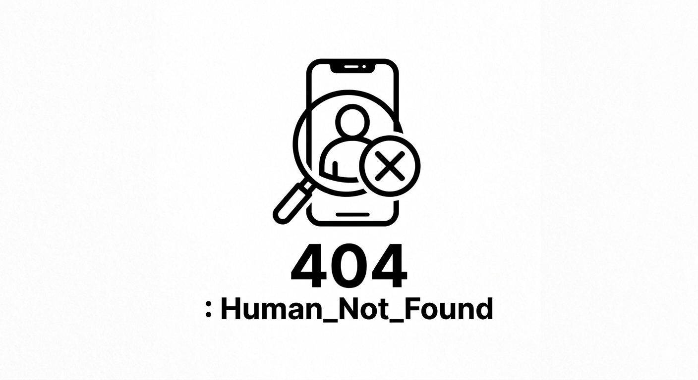

<p align="center">
  
</p>

# InSIGHT — AI 생성 콘텐츠 탐지기

> AI가 만든 이미지인지 아닌지, 자동으로 판별해드립니다.

## 프로젝트 소개

InSIGHT는 Instagram 등 SNS에서 수집한 이미지가 AI 생성물인지를 자동 판별하는 웹앱입니다.  
1차 필터(C2PA / EXIF / SynthID 워터마크)와 2차 필터(Gemini 2.5 Flash)를 순차적으로 적용합니다.

## 팀 구성

| 역할 | 이름 |
|------|------|
| 팀장 | 이지수 |
| 팀원 | 박효준 |
| 팀원 | 진민경 |
| 팀원 | 김성일 |
| 팀원 | 신우철 |

## 실행 방법

```bash
# 1. 가상환경 생성 및 활성화
python3.12 -m venv venv
source venv/bin/activate

# 2. 패키지 설치
pip install -r requirements.txt

# 3. 환경변수 설정 (.env)
GEMINI_API_KEY=your_api_key
INSTAGRAM_USERNAME=your_instagram_id

# 4. 실행
python insight_app.py
```

## 탐지 파이프라인

```
입력 (Instagram URL / 이미지 파일)
        ↓
   ── 1차 필터 ──────────────────────────
   C2PA 메타데이터 검증
   EXIF AI 도구 흔적 확인
   SynthID 워터마크 탐지 (CVR + 위상 분석)
        ↓ 감지 안 됨
   ── 2차 필터 ──────────────────────────
   Gemini 2.5 Flash 멀티모달 분석
        ↓
   ❌ AI 생성 / ✅ 실제 이미지 / ❓ 불확실
```

> 자세한 파이프라인 설명 → [PIPELINE.md](PIPELINE.md)

## 테스트 데이터셋

이미지 데이터셋은 용량 문제로 GitHub 대신 Google Drive에서 관리합니다.

**Google Drive:** https://drive.google.com/drive/folders/11Hu7vRj2f-l6ottcFQLy68xRHLheUs4w

| 폴더 | 내용 | 출처 |
|---|---|---|
| `test_dataset/ai/` | AI 생성 이미지 | Civitai API (Flux, SDXL 등) |
| `test_dataset/real/` | 실제 이미지 | randomuser.me, Unsplash |

로컬에서 실행하려면 위 링크에서 `test_dataset/` 폴더를 다운로드 후 프로젝트 루트에 배치하세요.
