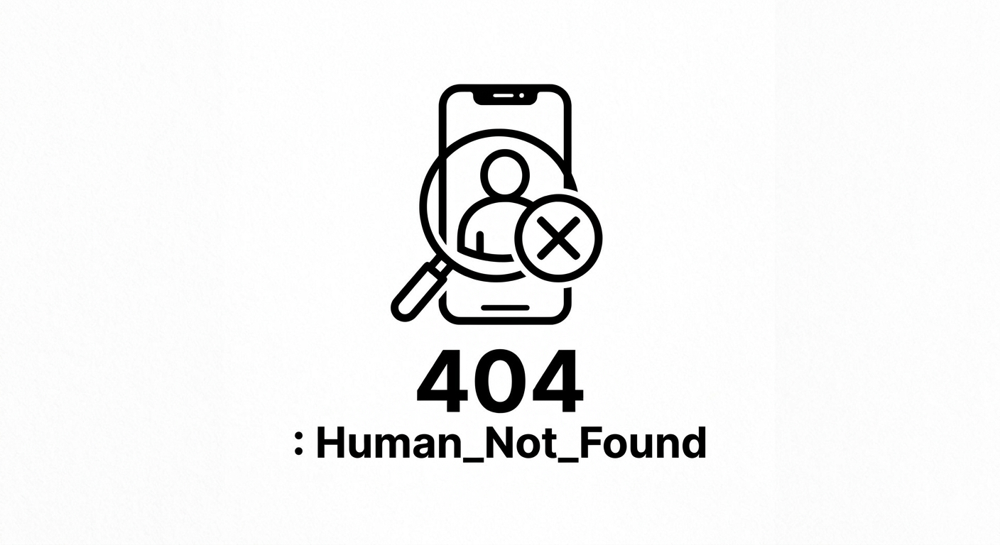

<p align="center">
  
</p>

# InSIGHT — AI 생성 콘텐츠 탐지기

> Instagram · YouTube URL 또는 이미지 파일을 입력하면 2단계 분석으로 AI 생성 여부를 판별합니다.

---

## 팀 구성

| 역할 | 이름 |
|------|------|
| 팀장 | 이지수 |
| 팀원 | 박효준 |
| 팀원 | 진민경 |
| 팀원 | 김성일 |
| 팀원 | 신우철 |

---

## 탐지 파이프라인

```
입력 (Instagram URL / YouTube URL / 이미지 파일)
        ↓
   ── Stage 1 — 메타데이터 / 포렌식 (무료, 로컬) ──────────
   EXIF  AI 도구 흔적 확인
   C2PA  출처 서명 검증
   VideoFact  포렌식 흔적 & 장면 문맥 분석 (WACV)
   FreqNet    주파수 성분 위조 패턴 탐지 (AAAI)
        ↓
   ── Stage 2 — AI 시각 분석 (선택, 모델 1개 선택) ────────
   Gemini 2.5 Flash   Google 멀티모달 LLM (API Key 필요)
   Gemma 4 (Ollama)   로컬 LLM — 무료, 프라이버시 보호
   앙상블 (ViT×2)     ai-image-detector-deploy + sdxl-detector
                       → 앙상블 선택 시 Gemma 시각 근거 설명 추가 옵션
        ↓
   ❌ AI 생성으로 의심 / ✅ 실제 이미지로 의심 / ❓ 판별 어려움
```

---

## 빠른 시작 (로컬 실행)

### 1단계 — 저장소 클론

```bash
git clone https://github.com/hjun912-p/Last_Project_test.git
cd Last_Project_test
```

### 2단계 — conda 환경 생성

```bash
conda env create -f environment_app.yml
conda activate insight
```

> pip만 사용하는 경우: `pip install -r requirements_app.txt`

### 3단계 — 환경변수 설정

```bash
cp env.example .env
# .env 파일을 열어 GEMINI_API_KEY 입력
```

### 4단계 — 외부 모델 가중치 다운로드

VideoFact / FreqNet 모델 가중치 자동 설치:

```bash
python setup_models.py
```

### 5단계 — Ollama 설치 (Gemma 4 사용 시)

```bash
# https://ollama.com 에서 설치 후
ollama pull gemma4:e4b   # 약 9.6 GB
ollama serve             # 별도 터미널에서 실행
```

### 6단계 — 앱 실행

```bash
python app.py
```

브라우저에서 `http://localhost:7860` 접속

---

## 프로젝트 파일 구조

```
Last_Project_test/
├── app.py                   # 메인 앱 실행 파일
├── ensemble_detector.py     # 앙상블 ViT 탐지 모듈 (deploy + sdxl)
├── videofact_wrapper.py     # VideoFact 래퍼
├── freqnet_wrapper.py       # FreqNet 래퍼
├── setup_models.py          # 모델 가중치 자동 다운로드
├── requirements_app.txt     # pip 패키지 목록
├── environment_app.yml      # conda 환경 설정 (insight)
├── env.example              # 환경변수 예시 → .env로 복사해서 사용
├── external/
│   ├── videofact/           # VideoFact 모델 코드 (setup_models.py로 설치)
│   └── freqnet/             # FreqNet 모델 코드 (setup_models.py로 설치)
├── members/                 # 팀원별 개인 작업 폴더
└── data/                    # 테스트 데이터셋 (Google Drive에서 다운로드)
```

---

## Stage 2 모델별 설정

| 모델 | 필요 설정 | 비용 |
|------|----------|------|
| Gemini 2.5 Flash | `GEMINI_API_KEY` (.env) | 무료 티어 있음 |
| Gemma 4 (Ollama) | Ollama 설치 + `gemma4:e4b` 풀 | 무료 (로컬) |
| 앙상블 (ViT×2) | 없음 (HuggingFace 자동 다운로드) | 무료 (로컬) |

> 설정이 없어도 앱은 실행됩니다. 해당 모델만 오류 표시됩니다.

---

## 테스트 데이터셋

이미지 데이터셋은 용량 문제로 Google Drive에서 관리합니다.

**Google Drive:** https://drive.google.com/drive/folders/11Hu7vRj2f-l6ottcFQLy68xRHLheUs4w

| 폴더 | 내용 | 출처 |
|------|------|------|
| `data/test_dataset/ai/` | AI 생성 이미지 | Civitai API (Flux, SDXL 등) |
| `data/test_dataset/real/` | 실제 이미지 | randomuser.me, Unsplash |

다운로드 후 프로젝트 루트의 `data/test_dataset/` 폴더에 배치하세요.

---

## 벤치마크 결과 (앙상블, 균형 데이터셋 200장)

| 지표 | 결과 | 목표 |
|------|------|------|
| Accuracy | 88.94% | ≥70% ✅ |
| Precision | 87.5% | ≥75% ✅ |
| Recall | 91.0% | ≥75% ✅ |
| F1-score | 89.22% | ≥70% ✅ |
| FPR | 13.13% | ≤20% ✅ |
| Avg Time | 0.734s | ≤3.0s ✅ |

> 6/6 목표 달성. 세부 분석 → `members/woochul/benchmark/`
