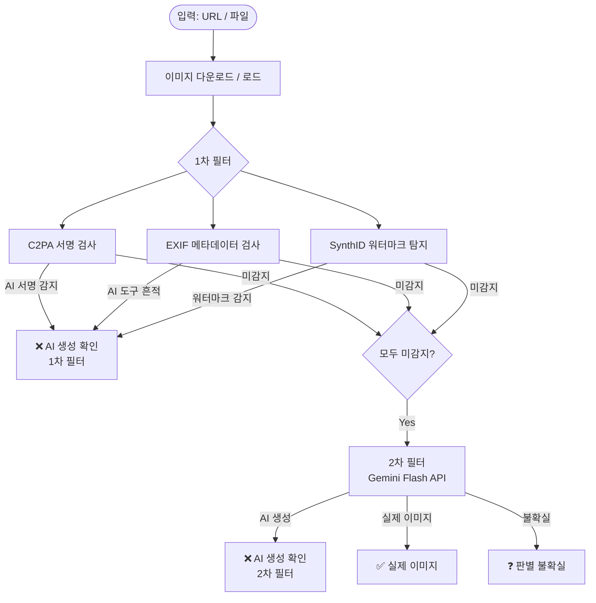

# InSIGHT — AI 생성 이미지 탐지 시스템 기능 문서

> **작성일**: 2026-04-29  
> **프로젝트**: InSIGHT (Instagram AI Image Detection)  
> **담당**: 신우철 (Track B — 1차 필터 성능 검증)

---

## 목차

1. [프로젝트 개요](#1-프로젝트-개요)
2. [전체 파이프라인 구조](#2-전체-파이프라인-구조)
3. [1차 필터 상세](#3-1차-필터-상세)
   - [C2PA 메타데이터 검사](#31-c2pa-메타데이터-검사)
   - [EXIF 메타데이터 검사](#32-exif-메타데이터-검사)
   - [SynthID 워터마크 탐지](#33-synthid-워터마크-탐지)
4. [2차 필터 상세 — Gemini Flash](#4-2차-필터-상세--gemini-flash)
5. [웹앱 UI 구조](#5-웹앱-ui-구조)
6. [배치 테스트 스크립트](#6-배치-테스트-스크립트)
7. [Vertex AI SynthID 벤치마크](#7-vertex-ai-synthid-벤치마크)
8. [파일 구조](#8-파일-구조)
9. [환경 설정](#9-환경-설정)
10. [향후 계획 (3단계 파이프라인)](#10-향후-계획-3단계-파이프라인)

---

## 1. 프로젝트 개요

InSIGHT는 Instagram 게시물 URL 또는 업로드된 이미지 파일을 입력받아  
**AI 생성 이미지인지 실제 사진인지** 자동으로 판별하는 웹 애플리케이션입니다.

### 핵심 목표

| 항목 | 내용 |
|------|------|
| 대상 | Instagram 게시물, 직접 URL, 로컬 이미지 파일 |
| 탐지 방식 | 2단계 파이프라인 (메타데이터/워터마크 → AI 추론) |
| 주요 기술 | C2PA, EXIF, SynthID, Gemini Flash API |
| UI 프레임워크 | Gradio |

---

## 2. 전체 파이프라인 구조

```
┌─────────────────────────────────────────────────────────────┐
│                    입력 (Input)                              │
│  Instagram URL  /  이미지 직접 URL  /  파일 업로드           │
└──────────────────────────┬──────────────────────────────────┘
                           │
                           ▼
┌─────────────────────────────────────────────────────────────┐
│              이미지 다운로드 / 로드                          │
│  • Instagram URL → instaloader → 이미지 URL 추출 → requests │
│  • 일반 URL → requests 직접 다운로드                        │
│  • 파일 업로드 → PIL.Image.open()                           │
└──────────────────────────┬──────────────────────────────────┘
                           │
                           ▼
┌─────────────────────────────────────────────────────────────┐
│                    1차 필터                                  │
│  ① C2PA 메타데이터 검사    (서명 기반, 코드 변조 불가)       │
│  ② EXIF 메타데이터 검사    (카메라/AI 도구 정보)            │
│  ③ SynthID 워터마크 탐지   (불가시 주파수 워터마크)         │
│                                                             │
│  → 하나라도 True면 → "AI 생성 확인" 즉시 반환              │
└──────────────┬───────────────────────┬──────────────────────┘
               │ 감지됨                 │ 미감지
               ▼                       ▼
    ┌─────────────────┐    ┌─────────────────────────────────┐
    │  ❌ AI 생성      │    │           2차 필터               │
    │  이미지 확인     │    │  Gemini Flash API (멀티모달)     │
    │  (1차 필터)      │    │  • gemini-2.5-flash             │
    └─────────────────┘    │  • gemini-3.1-flash  (선택 가능)│
                           └──────────┬──────────────────────┘
                                      │
                          ┌───────────┼───────────┐
                          ▼           ▼            ▼
                    ❌ AI 생성   ✅ 실제 이미지   ❓ 불확실
                    (2차 필터)
```

### 플로우차트 (Mermaid)



---

## 3. 1차 필터 상세

> **원칙**: 추론 모델 없이, 순수 메타데이터·신호 분석만으로 빠르고 무료로 판별

### 3.1 C2PA 메타데이터 검사

**C2PA(Coalition for Content Provenance and Authenticity)** 는 이미지에 디지털 서명을 내장하는 표준입니다.  
Adobe, Google, Microsoft 등이 참여하며, AI 생성 이미지에는 생성 도구 정보가 서명에 포함됩니다.

```python
def check_c2pa(image_path: str) -> tuple[bool | None, str]:
    if not C2PA_AVAILABLE:           # c2pa-python 미설치 시 스킵
        return None, "⚠️ c2pa-python 미설치"
    try:
        reader = c2pa.Reader(image_path)   # 이미지 파일에서 C2PA 매니페스트 읽기
        manifest_json = reader.json()      # JSON 형태로 변환

        if manifest_json:
            text = str(manifest_json).lower()
            # AI 생성 도구 키워드 목록
            ai_keywords = ["generativeai", "dall", "midjourney",
                           "stable diffusion", "firefly", "imagen",
                           "ai.generated", "trainedAlgorithmicMedia"]

            for kw in ai_keywords:
                if kw.lower() in text:
                    return True, f"❌ C2PA: AI 생성 서명 감지 ({kw})"  # AI 확인

            return False, "✅ C2PA: 원본 콘텐츠 서명 확인"  # 원본 서명 존재

    except Exception:
        pass
    return None, "🔍 C2PA: 메타데이터 없음"  # 서명 자체가 없음
```

**판정 로직**:
```
C2PA 서명 있음 + AI 키워드 → True  (AI 확인)
C2PA 서명 있음 + AI 아님   → False (원본 확인)
C2PA 서명 없음             → None  (판별 불가, 다음 검사로)
```

---

### 3.2 EXIF 메타데이터 검사

EXIF는 카메라 촬영 시 자동 기록되는 메타데이터입니다.  
AI 생성 이미지는 카메라 정보가 없거나, AI 도구명이 포함되어 있습니다.

```python
def check_exif(image: Image.Image) -> tuple[bool | None, str]:
    # 탐지 대상 AI 도구명 목록
    ai_tools = ["dall-e", "midjourney", "stable diffusion",
                "adobe firefly", "imagen", "generative",
                "ai generated", "synthid"]
    try:
        exif_raw = image._getexif()         # PIL EXIF 원시 데이터 추출
        if not exif_raw:
            # EXIF 없음 = AI 이미지일 가능성 있음 (카메라는 항상 EXIF 기록)
            return None, "🔍 EXIF: 메타데이터 없음 (AI 이미지 가능성)"

        # EXIF 태그 번호 → 태그 이름으로 변환
        exif = {TAGS.get(k, k): str(v) for k, v in exif_raw.items()}
        combined = " ".join(exif.values()).lower()   # 모든 값을 합쳐서 검색

        for tool in ai_tools:
            if tool in combined:
                return True, f"❌ EXIF: AI 도구 흔적 발견 ({tool})"  # AI 확인

        # 카메라 제조사/모델 정보 존재 → 실제 카메라 촬영 가능성
        camera_make  = exif.get("Make", "")
        camera_model = exif.get("Model", "")
        if camera_make or camera_model:
            return False, f"✅ EXIF: 카메라 정보 존재 ({camera_make} {camera_model})"

        return None, "🔍 EXIF: 카메라 정보 없음"   # 판별 불가

    except Exception:
        return None, "🔍 EXIF: 분석 불가"
```

**판정 로직**:
```
AI 도구명 발견            → True  (AI 확인)
카메라 Make/Model 존재    → False (실제 촬영 가능성)
EXIF 없음 / 카메라 없음   → None  (판별 불가)
```

---

### 3.3 SynthID 워터마크 탐지

Google의 SynthID는 Imagen/Gemini 생성 이미지에 **인간 눈에 보이지 않는 주파수 신호**를 심어두는 워터마크 기술입니다.

#### 탐지 방법 비교

| 방식 | 모듈 | 정확도 | 비용 | 인터넷 필요 |
|------|------|--------|------|------------|
| **Vertex AI 공식** | `synthid_vertex.py` | 높음 (공식 Google) | $0.0002/장 | 필요 |
| **역공학 근사** | `synthid_detector.py` | 중간 (291장 샘플 기반) | 무료 | 불필요 |

> **우선순위**: Vertex AI 공식 시도 → 실패 시 역공학 근사로 폴백

---

#### Vertex AI 공식 탐지 (`synthid_vertex.py`)

```python
def detect_synthid_vertex(image: Image.Image) -> tuple:
    """
    Returns: (True | None, 결과 메시지, 소요시간(초), 예상비용(USD))
    """
    # GCP 프로젝트 초기화 (gcloud auth application-default login 필요)
    vertexai.init(project="insight-494801", location="us-central1")

    # PIL Image → PNG bytes 변환
    buf = BytesIO()
    image.convert("RGB").save(buf, format="PNG")
    vertex_image = VertexImage(image_bytes=buf.getvalue())

    # Imagen 006 모델로 워터마크 탐지
    model = ImageGenerationModel.from_pretrained("imagegeneration@006")
    response = model.detect_watermark(vertex_image)

    # 신뢰도 등급 파싱
    confidence_str = response.watermark_detection_result.confidence
    # VERY_LIKELY / LIKELY → AI 생성 확인
    # POSSIBLE             → 불확실
    # UNLIKELY / VERY_UNLIKELY → 미감지
    detected = confidence_str in ("LIKELY", "VERY_LIKELY")
```

**신뢰도 등급 → 판정 매핑**:

```
VERY_LIKELY  (0.95)  →  True  ❌ 워터마크 감지
LIKELY       (0.75)  →  True  ❌ 워터마크 감지
POSSIBLE     (0.50)  →  None  ⚠️ 불확실
UNLIKELY     (0.25)  →  None  ✅ 미감지
VERY_UNLIKELY(0.05)  →  None  ✅ 미감지
```

---

#### 역공학 근사 탐지 (`synthid_detector.py`)

**원리**: 실제 Gemini 생성 이미지 291장에서 공통으로 발견된 55개 주파수 좌표를 캐리어로 사용

```
이미지 입력
    │
    ▼
512×512 리사이즈
    │
    ▼
다중 디노이저 융합 (노이즈 추출)
    ├── 웨이블렛 (db4 / sym8 / coif3)  × 3   가중치 1.0
    ├── 양방향 필터 (Bilateral)                가중치 0.8
    └── NLM (Non-Local Means)                  가중치 0.7
    │
    ▼
FFT (고속 푸리에 변환) → 주파수 도메인
    │
    ├──► CVR 계산
    │     캐리어 주파수 에너지 (55개)
    │     ─────────────────────────── = CVR 비율
    │     랜덤 위치 에너지 (220개)
    │     CVR > 2.0 → 워터마크 의심
    │
    └──► 위상 대칭 일관성 계산
          켤레 대칭 쌍의 위상이 일치할수록 워터마크 가능성 높음
    │
    ▼
최종 신뢰도 = CVR신뢰도 × 0.75 + 위상신뢰도 × 0.25
    │
    ├── ≥ 0.60  →  True  ❌ 워터마크 감지
    ├── 0.45~0.59  →  None  ⚠️ 경계값
    └── < 0.45  →  None  ✅ 미감지
```

**캐리어 주파수 시각화** (512px 기준, 중심 (256,256)):

```
주파수 공간 (FFT 도메인)
          ↑ fy
          │
    ●●●●  │  ●●●●   ← CARRIERS_DARK: 대각선 격자 패턴
    ●●●●──┼──●●●●     어두운 이미지에서 강하게 나타남
          │
    ────────────── fx
          │
    ○○○○○ │ ○○○○○   ← CARRIERS_WHITE: 수평축 패턴
          │           밝은 이미지에서 강하게 나타남
```

---

## 4. 2차 필터 상세 — Gemini Flash

1차 필터에서 **감지되지 않은 경우에만** 실행됩니다.  
Gemini 멀티모달 모델이 이미지를 시각적으로 분석합니다.

### 모델 선택 (UI에서 라디오 버튼으로 전환 가능)

| 모델 | 특징 |
|------|------|
| `gemini-2.5-flash` | 안정 버전, 빠름 |
| `gemini-3.1-flash` | 최신 버전, 성능 향상 |

### 분석 프롬프트 (6가지 체크포인트)

```
1. 피부·텍스처의 과도한 매끄러움 또는 부자연스러운 균일함
2. 손가락, 귀, 치아 등 세부 부위의 형태 이상
3. 배경의 비논리적 구조나 반복 패턴
4. 조명·그림자의 물리적 불일치
5. 눈동자 반사 또는 홍채의 비현실성
6. 텍스트·문자의 왜곡 또는 의미 없는 글자
```

### 응답 형식

```
판정: AI 생성 / 실제 이미지 / 불확실
신뢰도: 0~100%
근거: (2~3문장 한국어로)
```

### 코드 설명

```python
def run_filter_2(image: Image.Image, api_key: str,
                 model: str = "gemini-2.5-flash") -> tuple[bool | None, str]:

    client = genai.Client(api_key=api_key.strip())

    # PIL Image → JPEG bytes (API 전송용 압축)
    buf = BytesIO()
    image.save(buf, format="JPEG")

    # 텍스트 프롬프트 + 이미지 바이트를 함께 전송 (멀티모달)
    response = client.models.generate_content(
        model=model,
        contents=[
            GEMINI_PROMPT,
            types.Part.from_bytes(data=buf.getvalue(), mime_type="image/jpeg"),
        ],
    )
    text = response.text.strip()

    # "판정: AI 생성" 포함 여부로 최종 판정
    # "판정: AI 생성" 뒤 20자 안에 "실제 이미지"가 없는 경우만 AI로 판정
    is_ai = "AI 생성" in text and "실제 이미지" not in text.split("판정:")[1][:20]

    return is_ai, f"[2차 필터 — {model}]\n\n{text}"
```

---

## 5. 웹앱 UI 구조

```
┌─────────────────────────────────────────────────────────────────┐
│  🔍 InSIGHT — AI 생성 이미지 탐지기                             │
├──────────────────────────────┬──────────────────────────────────┤
│  입력 영역                   │  이미지 미리보기                  │
│  ┌──────────────────────┐   │  ┌──────────────────────────┐   │
│  │ Instagram URL 입력   │   │  │                          │   │
│  └──────────────────────┘   │  │     분석 대상 이미지      │   │
│  ┌──────────────────────┐   │  │                          │   │
│  │ 또는 파일 업로드     │   │  └──────────────────────────┘   │
│  └──────────────────────┘   │                                  │
│  ┌──────────────────────┐   │                                  │
│  │ Gemini API Key ****  │   │                                  │
│  └──────────────────────┘   │                                  │
│  ┌──────────────────────┐   │                                  │
│  │ 모델 선택            │   │                                  │
│  │ ● gemini-2.5-flash   │   │                                  │
│  │ ○ gemini-3.1-flash   │   │                                  │
│  └──────────────────────┘   │                                  │
│  [     분석 시작     ]       │                                  │
├──────────────────────────────┴──────────────────────────────────┤
│  최종 판정: ❌ AI 생성 이미지 확인 (1차 필터)                   │
├──────────────────────────────┬──────────────────────────────────┤
│  1차 필터 결과               │  2차 필터 결과                   │
│  [C2PA / EXIF / SynthID]     │  [Gemini Flash 분석 결과]        │
│                              │                                  │
└──────────────────────────────┴──────────────────────────────────┘
```

### 데이터 흐름 (Gradio)

```python
submit_btn.click(
    fn=process,                                          # 실행 함수
    inputs=[url_input, file_input,
            api_key_input, model_radio],                 # 입력 4개
    outputs=[verdict_output, filter1_output,
             filter2_output, image_preview]              # 출력 4개
)
```

---

## 6. 배치 테스트 스크립트

**파일**: `members/woochul/batch_test.py`

여러 Instagram URL을 한 번에 테스트하고 성능 지표를 측정합니다.

### 사용법

```python
# batch_test.py 상단의 TEST_URLS 목록에 테스트할 링크 추가
TEST_URLS = [
    ("https://www.instagram.com/p/AI링크/",   1, "AI 생성 이미지"),
    ("https://www.instagram.com/p/실제링크/", 0, "실제 사진"),
]

# 실행
python3 members/woochul/batch_test.py
```

### 출력 형식

```
════════════════════════════════════════
 [1차 필터 리포트]
 URL 1: ❌ SynthID 워터마크 감지
 URL 2: 🔍 감지 없음 → 2차 필터로

 [2차 필터 리포트]
 URL 2: 판정: AI 생성 / 신뢰도: 87%

 [전체 지표]
 Accuracy: 90.0%  Recall: 85.0%
════════════════════════════════════════
```

### 성능 지표

| 지표 | 설명 |
|------|------|
| Accuracy | 전체 정확도 |
| Precision | AI라고 판정한 것 중 실제 AI 비율 |
| Recall | 실제 AI 중 탐지한 비율 (핵심 지표) |
| F1 Score | Precision·Recall 조화평균 |
| FPR | 실제 이미지를 AI로 오탐한 비율 |

---

## 7. Vertex AI SynthID 벤치마크

**파일**: `members/woochul/benchmark/synthid_vertex_benchmark.py`

로컬 이미지 폴더를 기준으로 Vertex AI SynthID의 성능·비용·속도를 측정합니다.

### 채택 기준 (Track B 목표)

| 지표 | 목표값 |
|------|--------|
| Recall | ≥ 75% |
| 장당 비용 | ≤ $0.01 |
| 장당 처리 시간 | ≤ 3초 |

### 실행 방법

```bash
python3 members/woochul/benchmark/synthid_vertex_benchmark.py \
    --ai_dir   /path/to/ai_images \
    --real_dir /path/to/real_images \
    --max 50
```

### 출력 예시

```
============================================================
[ 혼동 행렬 ]
  TP: 42  FP: 3  FN: 8  TN: 47

[ 성능 지표 ]
  Accuracy  : 89.00%  ✅  (목표 70%+)
  Precision : 93.33%  ✅  (목표 75%+)
  Recall    : 84.00%  ✅  (목표 75%+) ★핵심
  F1 Score  : 88.42%  ✅  (목표 70%+)
  FPR       :  6.00%  ✅  (목표 20%-)

[ 비용 · 속도 ]
  장당 평균 비용: $0.0002  ✅
  장당 평균 시간: 1.23초   ✅

[ 1차 필터 채택 판정 ]
  ✅ 채택 권고 — 1차 필터로 통합 가능
============================================================
```

---

## 8. 파일 구조

```
Last_Project_test/
│
├── insight_app.py                   # 메인 Gradio 웹앱
├── synthid_vertex.py                # Vertex AI 공식 SynthID 탐지 모듈
├── synthid_detector.py              # 역공학 근사 SynthID 탐지 모듈 (폴백)
├── requirements.txt                 # 패키지 의존성
├── .env                             # API 키 (GEMINI_API_KEY 등)
│
└── members/
    └── woochul/
        ├── batch_test.py            # Instagram URL 배치 테스트
        └── benchmark/
            └── synthid_vertex_benchmark.py   # 성능·비용 벤치마크
```

---

## 9. 환경 설정

### 필수 패키지 (최소 설치)

```bash
pip3 install gradio Pillow requests python-dotenv \
             google-genai numpy scipy PyWavelets \
             c2pa-python instaloader \
             google-cloud-aiplatform
```

> `torch`, `torchvision`, `opencv-python` 등은 현재 앱에서 **미사용** — 설치 불필요

### `.env` 파일

```env
GEMINI_API_KEY=AIza...          # Google AI Studio에서 발급
INSTAGRAM_USERNAME=your_id      # (선택) 세션 파일 있을 때만
```

### Vertex AI 인증 (SynthID 공식 탐지용)

```bash
# 1. gcloud CLI 설치
brew install --cask google-cloud-sdk

# 2. 애플리케이션 기본 인증
gcloud auth application-default login

# 3. 프로젝트 설정
gcloud config set project insight-494801
```

---

## 10. 향후 계획 (3단계 파이프라인)

현재 2단계 구조를 향후 3단계로 확장할 예정입니다.

```
현재 (2단계)
─────────────────────────────────────────
1차 필터: C2PA / EXIF / SynthID (메타데이터·워터마크)
     ↓ 미감지
2차 필터: Gemini Flash API (추론 모델)


향후 (3단계)
─────────────────────────────────────────
1차 필터: C2PA / EXIF / SynthID (메타데이터·워터마크) ← 동일
     ↓ 미감지
2차 필터: 오픈소스 이미지 분류 모델               ← 신규 추가
          (ex. CNNDetection, CLIP 기반)
     ↓ 불확실
3차 필터: Gemini Flash / 추론 모델              ← 현재 2차가 3차로 이동
          모델별 성능 비교 (2.5-flash → 3.1-flash 톱다운)
```

### 단계별 역할

| 단계 | 방식 | 비용 | 속도 | 목적 |
|------|------|------|------|------|
| 1차 | 메타데이터 / 워터마크 | 무료~$0.0002 | 매우 빠름 | 확실한 케이스 조기 처리 |
| 2차 | 오픈소스 분류 모델 | 무료 (로컬) | 빠름 | 중간 난이도 케이스 처리 |
| 3차 | Gemini / 추론 LLM | 유료 API | 느림 | 어려운 케이스 최종 판별 |

---

*이 문서는 2026-04-29 기준 구현 내용을 반영합니다.*
