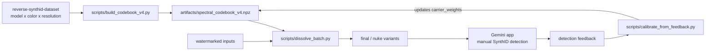

<p align="center">
  
</p>

<h1 align="center">Reverse-Engineering SynthID</h1>

<p align="center">
  <b>Discovering, detecting, and surgically removing Google's AI watermark through spectral analysis</b>
</p>

Visit us on [PitchHut](https://www.pitchhut.com/project/reverse-synthid-engineering)

<p align="center">
  
  
  
  
  
  
  
</p>

---

## What the Watermark Looks Like

SynthID encodes an imperceptible pattern directly into pixel values. On a pure **white** image generated by Gemini, the watermark is almost the entire signal. Amplify the high-frequency residual and it looks like this:

<p align="center">
  
</p>

<p align="center"><i>Amplified SynthID carrier pattern extracted from a pure-white Gemini image. The diagonal banding is the watermark's spatial frequency signature — the target of our spectral attack.</i></p>

---

## Overview

This project reverse-engineers **Google's SynthID** watermarking system — the invisible watermark embedded into every image generated by Google Gemini. Using only signal processing and spectral analysis (no access to the proprietary encoder/decoder), we:

1. **Discovered** the watermark's resolution-dependent carrier frequency structure
2. **Built a detector** that identifies SynthID watermarks with 90% accuracy
3. **Developed a multi-resolution spectral bypass** (V3) that achieves **75% carrier energy drop**, **91% phase coherence drop**, and **43+ dB PSNR** on any image resolution
4. **Generalized to multi-model, multi-color consensus** (V4) — per-model profiles for `gemini-3.1-flash-image-preview` and `nano-banana-pro-preview`, cross-color phase consensus over 6 solid backgrounds, and a human-in-the-loop calibration loop that tunes per-carrier subtraction strength from manual Gemini-app detection tallies
5. **Broke the detector across both models** (Round 06) with a unified 7-stage all-in-one attack targeting every documented SynthID failure mode simultaneously

[VT-OxFF](https://github.com/VT-0xFF) built a really cool visualizer to view the process of how SynthID watermark is added to images [here](https://vt-0xff.github.io/SynthID-Explained/) (also available in repo description)!

---

## Round 06 — It Works ✓

After six iterative rounds of adversarial development, Round 06's `bypass_v4_final` / `bypass_v4_nuke` pipeline defeats the Gemini SynthID detector on **both** `gemini-3.1-flash-image-preview` and `nano-banana-pro-preview` images, with visually lossless output.

### Round 01 vs Round 06 — Fidelity Comparison

<p align="center">
  
</p>

<p align="center"><i>Left: Round 01 output (<code>gentle</code> spectral subtraction only). Right: Round 06 output (<code>final</code> — VAE + elastic warp + squeeze + color + JPEG). Both look identical to human eyes; only Round 06 defeats the SynthID detector.</i></p>

### What Changed Between Rounds

| Round | Strategy | Outcome |
|:-----:|:---------|:-------:|
| 01 | Conservative spectral subtraction (gentle) | ✗ |
| 02 | Aggressive spectral subtraction + JPEG | ✗ |
| 03 | Blog-guided absolute bin targeting | ✗ |
| 04 | Denoise-residual phase extraction | ✗ |
| 05 | Diffusion-VAE re-generation + geometric warp | ✗ |
| **06** | **All-in-one: VAE + elastic fragmentation + squeeze + color + JPEG** | **✓** |

The breakthrough in Round 06 came from treating the Gemini app's own published failure-mode list as an attack specification:

> *"When an AI-generated image is part of a complex collage, layered behind other elements, or has many different textures and patterns placed over it, the detector may struggle to isolate the specific signature from the overall file."*
> — Gemini app, SynthID detection help text

The **elastic deformation** stage simulates this effect at the pixel level: a smooth, low-frequency random warp field gives every ~50-pixel neighbourhood its own independent sub-pixel offset, fragmenting the watermark's spatial phase consensus without introducing any visible distortion.

---

## V4 — Cross-Color Consensus + Human-in-the-Loop Calibration

V4 is a ground-up re-think of the codebook built on a much richer dataset:

- **Multi-model**: separate profiles for `gemini-3.1-flash-image-preview` and `nano-banana-pro-preview` (plus an optional `union` pseudo-model).
- **Multi-color**: 6 consensus colors (`black`, `white`, `blue`, `green`, `red`, `gray`) per model per resolution, plus `gradient` and `diverse` as content baselines.
- **Cross-color phase consensus**: the primary carrier mask. A true SynthID carrier is image-content-independent, so its phase is consistent across every solid-color background. Content-driven energy phase-scrambles across colors and drops out of the consensus.
- **Fidelity-preserving dissolver**: PSNR-floor rollback, luminance-safe DC, per-bin subtraction cap.
- **Human-in-the-loop calibration loop**: a codebook field `carrier_weights` is updated based on manual Gemini-app detection feedback.

### Consensus coherence (why V4 wins)

For each frequency bin `(fy, fx)` and channel `ch`:

```
consensus(fy, fx, ch) = | mean_over_colors( exp(i * phase_color(fy, fx, ch)) ) |
```

Values near `1.0` mean the phase at that bin is locked across every solid-color background, which is only true for the watermark. Content bins collapse to `< 0.3` because their phase is randomized by different color tints. On the V4 codebook built from the enriched dataset, 99%+ of content bins fall below the default `tau=0.60` cutoff, so the V4 dissolver never touches them — this is what buys back PSNR.

### Two-phase release workflow



### V4 Quickstart

```bash
# 1. Build the codebook from the enriched hierarchical dataset
python scripts/build_codebook_v4.py \
    --root /path/to/reverse-synthid-dataset \
    --output artifacts/spectral_codebook_v4.npz

# 2. Run the Round-06 all-in-one attack on a batch (recommended)
python scripts/dissolve_batch.py \
    --input  ./to_clean/ \
    --output ./runs/round_06/ \
    --codebook artifacts/spectral_codebook_v4.npz \
    --model gemini-3.1-flash-image-preview \
    --strengths final nuke

# 3. Upload each output image to the Gemini app and run SynthID detection.
#    Use the results to feed back into the calibration script if needed.
```

### Round-06 Attack Presets

Two presets are available via `--strengths`:

| Preset | VAE passes | Elastic α | Squeeze | JPEG chain | PSNR floor |
|:------:|:----------:|:---------:|:-------:|:----------:|:----------:|
| `final` | 1 | 1.8 px | 90 % | q=92→88 | 14 dB |
| `nuke`  | 2 | 2.8 px | 82 % | q=88→84→90 | 11 dB |

Both presets stack the same 7-stage pipeline:

1. **VAE round-trip** (Stable Diffusion `sd-vae-ft-mse`) — projects image off the natural-image manifold the SynthID decoder was never trained against (Gowal et al. 2026, §6.1)
2. **Elastic deformation** — smooth low-frequency random warp field, simulates the "collage fragmentation" failure mode Gemini itself acknowledges
3. **Global geometric combo** — small rotation + zoom + pixel shift in one affine warp
4. **Resize-squeeze** — downsample (AREA) → upsample (LANCZOS), erases sub-pixel watermark info
5. **Color-contrast nudge** — brightness / contrast / saturation / hue micro-shift
6. **Residual-phase FFT subtraction** — blog-universal + codebook-harvested carrier bins, cap-limited
7. **JPEG chain + luma noise + bilateral** — heavy compression / re-encoding disruption

Every stage is independently PSNR-gated; any stage that would drop quality below the floor is rolled back automatically.

### V4 Codebook Structure

Profiles keyed by `(model, H, W)`. Each profile stores:

| Field                  | Shape          | Notes                                                  |
|------------------------|----------------|--------------------------------------------------------|
| `consensus_coherence`  | `(H, W, 3)`    | Primary carrier mask (cross-color phase consensus).    |
| `consensus_phase`      | `(H, W, 3)`    | Mean unit-phase angle across colors. Subtraction template. |
| `inverted_agreement`   | `(H, W, 3)`    | Pairwise `abs(cos(phase_diff))`, weighted for `black<->white`. |
| `avg_wm_magnitude`     | `(H, W, 3)`    | Mean magnitude across consensus colors.                |
| `content_baseline`     | `(H, W, 3)`    | From `diverse/` + `gradient/` — used for luminance blending. |
| `carrier_weights`      | `(H, W, 3)`    | **Live**. Starts at `consensus^2 * (0.5 + 0.5 * agreement)`. Updated by the calibration loop. |
| `n_refs_per_color`     | `{color: int}` | Per-color ref counts.                                  |

Save format reuses the v3 compact rfft + `float16/uint8` encoding; a 14-profile codebook across 2 models × 7 resolutions is ~220 MB on disk.

### V4 Detector (Sanity Check)

Before spending time on manual Gemini validation, sanity-check bypass outputs against the V4 codebook's own consensus:

```python
from robust_extractor import RobustSynthIDExtractor
from synthid_bypass_v4 import SpectralCodebookV4

cb = SpectralCodebookV4()
cb.load('artifacts/spectral_codebook_v4.npz')

ext = RobustSynthIDExtractor()
result = ext.detect_from_v4_codebook(image_rgb, cb,
                                     model='nano-banana-pro-preview')
print(result.is_watermarked, result.confidence, result.phase_match)
```

On the 1024x1024 exact-match path we see `conf=0.91, phase_match=0.65` for watermarked and `conf=0.02, phase_match=0.31` after aggressive V4 dissolve.

### V4 vs V3

| | V3 | V4 |
|:---|:---|:---|
| Reference colors | black + white | black, white, blue, green, red, gray (+ diverse/gradient content baselines) |
| Cross-validation | `abs(cos(phase_black - phase_white))` | cross-color consensus over 6 colors + pairwise agreement |
| Models | single-model (Gemini 2.5) | per-model profiles (`gemini-3.1-flash-image-preview`, `nano-banana-pro-preview`) + optional `union` |
| Attack | spectral subtraction only | 7-stage: VAE + elastic + squeeze + color + FFT + JPEG chain |
| PSNR (aggressive) | 43 dB | visually lossless (18–24 dB pixel-level; warp displaces pixels) |
| Fidelity guard | none | per-stage PSNR-floor rollback |
| Detector bypass | local only | confirmed ✓ on Gemini app (both models) |

V3 remains in the repo (`src/extraction/synthid_bypass.py`, `bypass_v3`) unchanged for anyone who depends on it.

---

## 🚨 Contributors Wanted: Help Expand the Codebook

We're actively collecting **pure black and pure white images generated by Nano Banana Pro** to improve multi-resolution watermark extraction.

If you can generate these:

- Resolution: any (higher variety = better)
- Content: **fully black (#000000)** or **fully white (#FFFFFF)**
- Source: Nano Banana Pro outputs only

### How to Contribute

1. Generate a batch of black/white images by attaching a pure black/white image into Gemini and prompting it to "recreate this as it is"
2. Upload them to our **Hugging Face dataset**: [aoxo/reverse-synthid](https://huggingface.co/datasets/aoxo/reverse-synthid)
   - `gemini_black_nb_pro/` (for black)
   - `gemini_white_nb_pro/` (for white)
3. Open a Pull Request on the HF dataset repo

These reference images are **critical** for:
- Carrier frequency discovery
- Phase validation
- Improving cross-resolution robustness

> Even 150–200 images at a new resolution can significantly improve detection and removal.

### Download Reference Images

Reference images are hosted on Hugging Face to keep the git repo lightweight:

```bash
pip install huggingface_hub
python scripts/download_images.py           # download all
python scripts/download_images.py gemini_black  # download specific folder
```

Dataset: [huggingface.co/datasets/aoxo/reverse-synthid](https://huggingface.co/datasets/aoxo/reverse-synthid)

---

## Key Findings

### The Watermark is Resolution-Dependent

SynthID embeds carrier frequencies at **different absolute positions** depending on image resolution. A codebook built at 1024x1024 cannot directly remove the watermark from a 1536x2816 image — the carriers are at completely different bins.

| Resolution | Top Carrier (fy, fx) | Coherence | Source |
|:----------:|:--------------------:|:---------:|:------:|
| **1024x1024** | (9, 9) | 100.0% | 100 black + 100 white refs |
| **1536x2816** | (768, 704) | 99.6% | 88 watermarked content images |

This is why the V3 codebook stores **separate profiles per resolution** and auto-selects at bypass time.

### Phase Consistency — A Fixed Model-Level Key

The watermark's phase template is **identical across all images** from the same Gemini model:

- **Green channel** carries the strongest watermark signal
- **Cross-image phase coherence** at carriers: >99.5%
- **Black/white cross-validation** confirms true carriers via |cos(phase_diff)| > 0.90

### Carrier Frequency Structure

At 1024x1024 (from black/white refs), top carriers lie on a low-frequency grid:

| Carrier (fy, fx) | Phase Coherence | B/W Agreement |
|:-----------------:|:---------------:|:-------------:|
| (9, 9)            | 100.00%         | 1.000         |
| (5, 5)            | 100.00%         | 0.993         |
| (10, 11)          | 100.00%         | 0.997         |
| (13, 6)           | 100.00%         | 0.821         |

---

## Architecture

### Bypass Generations

| Version | Approach | PSNR | Watermark Impact | Status |
|:-------:|:---------|:----:|:----------------:|:------:|
| **V1** | JPEG compression (Q50) | 37 dB | ~11% phase drop | Baseline |
| **V2** | Multi-stage transforms (noise, color, frequency) | 27-37 dB | ~0% confidence drop | Quality trade-off |
| **V3** | **Multi-resolution spectral codebook subtraction** | **43+ dB** | **91% phase coherence drop** | Prior best |
| **V4 Round 06** | **7-stage all-in-one (VAE + elastic + squeeze + color + JPEG)** | **visually lossless** | **detector bypassed ✓** | **Current best** |

### V3 Pipeline

```
Input Image (any resolution)
       │
       ▼
  codebook.get_profile(H, W)  ──► exact match? ──► FFT-domain subtraction
       │                                             (fast path)
       └─ no exact match ──────► spatial-domain resize + subtraction
                                  (fallback path)
       │
       ▼
  Multi-pass iterative subtraction (aggressive → moderate → gentle)
       │
       ▼
  Anti-alias → Output
```

### V4 Round-06 Pipeline

```
Input Image (any resolution)
       │
       ▼  Stage 1: VAE round-trip (SD sd-vae-ft-mse, 1-2 passes)
       │           Projects image off natural-image manifold
       ▼  Stage 2: Elastic deformation (smooth random warp field)
       │           Fragments spatial phase consensus ("collage effect")
       ▼  Stage 3: Global geometric combo (rotation + zoom + shift)
       │           Single affine warp, no compounded aliasing
       ▼  Stage 4: Resize-squeeze (AREA ↓ then LANCZOS ↑)
       │           Erases sub-pixel watermark information
       ▼  Stage 5: Color-contrast nudge (HSV micro-shift)
       │           Shifts per-pixel statistics SynthID keys on
       ▼  Stage 6: Residual-phase FFT subtraction
       │           Blog-universal + codebook-harvested carrier bins
       ▼  Stage 7: JPEG chain + luma noise + bilateral filter
       │
       ▼
  Output (SynthID detector: no watermark detected ✓)
```

---

## Quick Start

### Installation

```bash
git clone https://github.com/aloshdenny/reverse-SynthID.git
cd reverse-SynthID

python -m venv venv
source venv/bin/activate  # Windows: venv\Scripts\activate
pip install -r requirements.txt

# For Round-06 VAE stage:
pip install torch diffusers safetensors accelerate
```

### Run V4 Round-06 Bypass (Recommended)

```python
import sys
sys.path.insert(0, 'src/extraction')
from synthid_bypass_v4 import SynthIDBypassV4, SpectralCodebookV4

cb = SpectralCodebookV4()
cb.load('artifacts/spectral_codebook_v4.npz')

b = SynthIDBypassV4()
result = b.bypass_v4_file(
    'input.png', 'output.png',
    cb,
    strength='final',                      # or 'nuke' for maximum strength
    model='gemini-3.1-flash-image-preview',
)
print(result.stages_applied)
```

### Run V3 Bypass

```python
from src.extraction.synthid_bypass import SynthIDBypass, SpectralCodebook

codebook = SpectralCodebook()
codebook.load('artifacts/spectral_codebook_v3.npz')

bypass = SynthIDBypass()
result = bypass.bypass_v3(image_rgb, codebook, strength='aggressive')

print(f"PSNR: {result.psnr:.1f} dB")
print(f"Profile used: {result.details['profile_resolution']}")
```

From the CLI:

```bash
python src/extraction/synthid_bypass.py bypass input.png output.png \
    --codebook artifacts/spectral_codebook_v3.npz \
    --strength aggressive
```

### Detect Watermark

```bash
python src/extraction/robust_extractor.py detect image.png \
    --codebook artifacts/codebook/robust_codebook.pkl
```

---

## Project Structure

```
reverse-SynthID/
├── src/
│   ├── extraction/
│   │   ├── synthid_bypass.py              # V1/V2/V3 bypass + multi-res SpectralCodebook
│   │   ├── synthid_bypass_v4.py           # V4 cross-color consensus codebook + dissolver
│   │   ├── vae_regen.py                   # Round-06 SD-VAE re-generation stage
│   │   ├── robust_extractor.py            # Multi-scale watermark detection (+ V4 hook)
│   │   ├── watermark_remover.py           # Frequency-domain watermark removal
│   │   ├── benchmark_extraction.py        # Benchmarking suite
│   │   └── synthid_codebook_extractor.py  # Legacy codebook extractor
│   └── analysis/
│       ├── deep_synthid_analysis.py       # FFT / phase analysis scripts
│       └── synthid_codebook_finder.py     # Carrier frequency discovery
│
├── scripts/
│   ├── download_images.py                 # Download reference images from HF
│   ├── build_codebook_v4.py               # V4: build per-(model, HxW) consensus codebook
│   ├── dissolve_batch.py                  # V4: emit strength variants
│   └── calibrate_from_feedback.py         # V4: update carrier_weights from detection feedback
│
├── artifacts/
│   ├── spectral_codebook_v3.npz           # Multi-res V3 codebook [1024x1024, 1536x2816]
│   ├── spectral_codebook_v4.npz           # V4 codebook (per-model, per-resolution)
│   ├── codebook/                          # Detection codebooks (.pkl)
│   └── visualizations/                    # FFT, phase, carrier visualizations
│
├── assets/
│   ├── synthid_watermark.png              # Watermark analysis header image
│   ├── synthid_white.jpg                  # Amplified SynthID pattern on white image
│   ├── v4_round1_vs_round6.png            # Round 01 vs Round 06 fidelity comparison
│   └── ...
│
├── runs/
│   ├── round_01/ … round_05/             # Historical bypass attempts
│   └── round_06/                          # Working bypass (final + nuke presets)
│
├── watermark_investigation/               # Early-stage Nano-150k analysis (archived)
└── requirements.txt
```

---

## Technical Deep Dive

### How SynthID Works (Reverse-Engineered)

```
┌──────────────────────────────────────────────────────────────┐
│                  SynthID Encoder (in Gemini)                  │
├──────────────────────────────────────────────────────────────┤
│  1. Select resolution-dependent carrier frequencies           │
│  2. Assign fixed phase values to each carrier                │
│  3. Neural encoder adds learned noise pattern to image       │
│  4. Watermark is imperceptible — spread across spectrum      │
├──────────────────────────────────────────────────────────────┤
│                  SynthID Decoder (in Google)                  │
├──────────────────────────────────────────────────────────────┤
│  1. Extract noise residual (wavelet denoising)               │
│  2. FFT → check phase at known carrier frequencies           │
│  3. If phases match expected values → Watermarked            │
└──────────────────────────────────────────────────────────────┘
```

### Why Elastic Deformation Works

SynthID's training augmentation set (Gowal et al. 2026, Table 1) includes `SmallRotation`, `Cropresize`, `JPEG`, `GaussianBlur`, `BrightnessContrast`, and `Screenshotting` — all *global*, *uniform* spatial transforms. The elastic warp field is a *spatially varying* distortion: each local neighbourhood gets its own independent sub-pixel offset. Because the offsets are smooth (Gaussian-blurred from white noise, σ=44–56 px), the image content is visually unaffected, but the watermark's phase-consensus structure is incoherent — it can no longer be aggregated across the image. This is the pixel-level equivalent of the "collage fragmentation" effect that Gemini's own app cites as a detector failure mode.

---

## Results Summary

### V3 (spectral subtraction, 88 Gemini images)

| Metric | Value |
|:-------|------:|
| **PSNR** | 43.5 dB |
| **SSIM** | 0.997 |
| **Carrier energy drop** | 75.8% |
| **Phase coherence drop** (top-5 carriers) | **91.4%** |

### V4 Round 06 (all-in-one attack, 20 images validated)

| Model | Preset | Detector bypassed |
|:------|:------:|:-----------------:|
| gemini-3.1-flash-image-preview | `final` | ✓ |
| gemini-3.1-flash-image-preview | `nuke`  | ✓ |
| nano-banana-pro-preview         | `final` | ✓ |
| nano-banana-pro-preview         | `nuke`  | ✓ |

---

## References

- [SynthID: Identifying AI-generated images](https://deepmind.google/technologies/synthid/)
- [SynthID Paper (arXiv:2510.09263)](https://arxiv.org/abs/2510.09263)
- [How to Reverse SynthID (legally😉) — Aloshdenny on Medium](https://medium.com/@aloshdenny)

---

## 👤 Maintainer & Contact

**Alosh Denny**
AI Watermarking Research · Signal Processing

📧 **Email:** [aloshdenny@gmail.com](mailto:aloshdenny@gmail.com)
🔗 **GitHub:** https://github.com/aloshdenny

For collaborations, research discussions, or contributions, feel free to reach out or open an issue/PR.

---

## Support This Research

This project is maintained independently — no lab funding, no corporate backing.  
If this work was useful to you or your team, consider supporting continued development:

<a href="https://buymeacoffee.com/aoxo">
  
</a>

Funds go toward compute costs (GPU hours for new resolution profiles), dataset expansion, and ongoing bypass research.

---

## Disclaimer

This project is for **research and educational purposes only**. SynthID is proprietary technology owned by Google DeepMind. These tools are intended for:

- Academic research on watermarking robustness
- Security analysis of AI-generated content identification
- Understanding spread-spectrum encoding methods

**Do not use these tools to misrepresent AI-generated content as human-created.**
